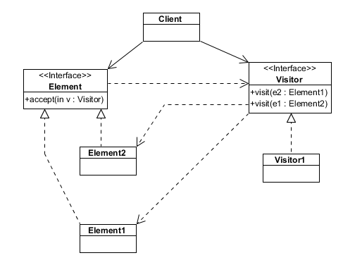

## Visitor ##

Represent an operation to be performed on the elements of an object structure. Visitor lets you define a new operation without changing the classes of the elements on which it operates.
The classic technique for recovering lost type information.
Do the right thing based on the type of two objects.
Double dispatch

##Class diagram##

~~~c#
namespace VisitorPattern
{
    public interface IVisitor
    {
        float Visit(Item item);
    }
}

~~~
~~~c#
namespace VisitorPattern
{
    public class ShopingCartPriceVisitor : IVisitor
    {
        private float itemPrice;

        public float Visit(Item item)
        {
            if (item.Weight < 100)
            {
                itemPrice = item.Weight * 0.2f;
            }
            else
                itemPrice = item.Weight * 0.1f;

            return itemPrice;
        }
    }
}

~~~

~~~c#
namespace VisitorPattern
{
    public class ShopingCartWeightVisitor : IVisitor
    {
        float totalWeightForCart;

        public float Visit(Item item)
        {
            totalWeightForCart = item.Weight;
            return totalWeightForCart;
        }
    }
}

~~~

~~~c#
namespace VisitorPattern
{
    public abstract class Item
    {

        public Item(float weight)
        {
            this.Weight = weight;
        }

        public float Weight { get; set; }

        public float Accept(IVisitor visitor)
        {
            return visitor.Visit(this);
        }
    }
}
~~~

~~~c#
namespace VisitorPattern.Items
{
    public class Book : Item
    {
        public Book(float weight,string title)
            : base(weight)
        {
            this.Title = title;
        }

        public string Title { get; set; }
    }
}
~~~
~~~c#
namespace VisitorPattern
{
    public class ShoppingCart
    {
        private readonly List<Item> items = new List<Item>();

        public void Add(Item item)
        {
            this.items.Add(item);
        }

        public void Remove(Item item)
        {
            this.items.Remove(item);
        }

        public float CalculateTotal(IVisitor visitor)
        {
            float total = 0;
            foreach (var item in this.items)
            {
                total += item.Accept(visitor);
            }

            return total;
        }

    }
}
~~~

Usage
~~~c#
namespace VisitorPattern
{
    class Program
    {
        static void Main(string[] args)
        {
            var someBook = new Book(80, "Title of the book");
            var anotherBook = new Book(150,"Another title");
            var thirdBook = new Book(200, "Neshto");

            ShoppingCart cart = new ShoppingCart();
            cart.Add(someBook);
            cart.Add(anotherBook);

            float totalPrice = cart.CalculateTotal(new ShopingCartPriceVisitor());
            float totalWeight = cart.CalculateTotal(new ShopingCartWeightVisitor());

            Console.WriteLine("The total price of the cart is {0}, and the weight is {1} ", totalPrice, totalWeight);

        }
    }
}
~~~
