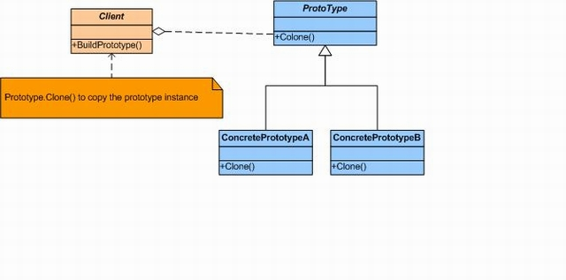

## Prototype Design Pattern##
Prototype Design Pattern is a pattern we use to receive an object instance for a particular class, such as builder and factory pattern. Instead of having a new fresh object every time, we can make a copy of an existed object instantly (object we can use as Prototype) and start using it. In that way, we do not have to repeat the building process for the object we are trying to use. The new copy object is totally independent with the original prototype object, and can be used for any purpose that will not affect the original. There is no limit for copying the existing objects, any existing object can be copied. 
##Class Diagram:##

 
###### Prototype implementation
~~~c#
  abstract class Prototype
  {
    private string id;

    // Constructor 
    public Prototype(string id)
    {
      this.id = id;
    }

    // Property 
    public string Id
    {
      get{ return id; }
    }

    public abstract Prototype Clone();
  }

  
  class ConcretePrototype1 : Prototype
  {
    
    public ConcretePrototype1(string id) : base(id) 
    {
    }

    public override Prototype Clone()
    {
      
      return (Prototype)this.MemberwiseClone();
    }
  }

  
  class ConcretePrototype2 : Prototype
  {
    // Constructor 
    public ConcretePrototype2(string id) : base(id) 
    {
    }

    public override Prototype Clone()
    {
    
      return (Prototype)this.MemberwiseClone();
    }
  }

  class MainApp
  {
 
    static void Main()
    {
      ConcretePrototype1 p1 = new ConcretePrototype1("I");
      ConcretePrototype1 c1 = (ConcretePrototype1)p1.Clone();
      Console.WriteLine ("Cloned: {0}", c1.Id);

      ConcretePrototype2 p2 = new ConcretePrototype2("II");
      ConcretePrototype2 c2 = (ConcretePrototype2)p2.Clone();
      Console.WriteLine ("Cloned: {0}", c2.Id);

    }
  }

~~~