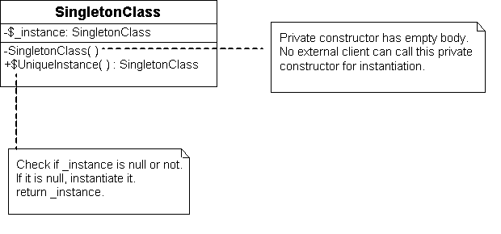

## Singleton Pattern ##
Singleton e pattern който ни позволява един клас да има единствена инстанция в цялата програма. Това означава че той ни подсигурява, никой друг които ползва нашия клас да не може да праи и ползва друга инстанция освен тази която ние сме я предоставили. Този pattern изисква две неща:

- 1.Никой да неможе да създава инстанция на нашия клас т.е. да забраним създаване на повече од една инстанция

- 2.Тази инстанция да я подржаме и когато на някой му трябва да може да я обезбедим за ползване.

Когато имплементираме този pattern трябва да подсигурим  единствената инстанция която създаваме да я създадем в момента в който за първи път ще има нейна нужда чрез Lаzy loading.

Също така трябва да сме внимателни при повече нишково програмиране защото може в един момент повече нишки да се опитат да създадат инстанция което означава че ще има повече од една инстанция което не би трябвало да се случва при Singleton pattern-a. 
 
Значи Singleton pattern-a не е Thread Safe и трябва да сме много внимателни когато искаме да го исползваме при многонишково програмиране т.е. трябва да използваме някой от методите за thread-safe инстанциране, за да няма възможност две или повече нишки едновременно да създадат инстанция на класа.

##Клас диаграма:##

Implementing Singleton in C#

Retired Content
This content is outdated and is no longer being maintained. It is provided as a courtesy for individuals who are still using these technologies. This page may contain URLs that were valid when originally published, but now link to sites or pages that no longer exist. Please see the patterns & practices guidance for the most current information.
Ff650316.ImpSingletonInCsharp(en-us,PandP.10).png
Version 1.0.1
GotDotNet community for collaboration on this pattern
Complete List of patterns & practices
Context
You are building an application in C#. You need a class that has only one instance, and you need to provide a global point of access to the instance. You want to be sure that your solution is efficient and that it takes advantage of the Microsoft .NET common language runtime features. You may also want to make sure that your solution is thread safe.
Implementation Strategy
Even though Singleton is a comparatively simple pattern, there are various tradeoffs and options, depending upon the implementation. The following is a series of implementation strategies with a discussion of their strengths and weaknesses.
Singleton
The following implementation of the Singleton design pattern follows the solution presented in Design Patterns: Elements of Reusable Object-Oriented Software [Gamma95] but modifies it to take advantage of language features available in C#, such as properties:
 
###### Singleton implementation
~~~c#
using System;

public class Singleton
{
   private static Singleton instance;

   private Singleton() {}

   public static Singleton Instance
   {
      get
      {
         if (instance == null)
         {
            instance = new Singleton();
         }
         return instance;
      }
   }
}
~~~
 
###### Multithreading Singleton implementation
~~~c#
using System;

public sealed class Singleton
{
   private static volatile Singleton instance;
   private static object syncRoot = new Object();

   private Singleton() {}

   public static Singleton Instance
   {
      get 
      {
         if (instance == null) 
         {
            lock (syncRoot) 
            {
               if (instance == null) 
                  instance = new Singleton();
            }
         }

         return instance;
      }
   }
}
~~~