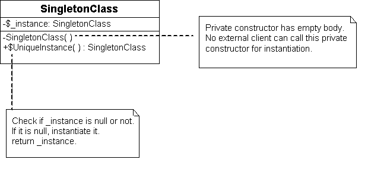

## Singleton Pattern ##
Singleton e pattern който ни позволява един клас да има единствена инстанция в цялата програма. Това означва че някой друг които ползва нашия клас не може да прави и ползва друга инстанция освен тази която ние сме я предоставили. Този pattern изисква две неща:

- 1.Никой да не може да създава инстанция на нашия клас т.е. да забраним създаване на повече од една инстанция

- 2.Тази инстанция да я поддържаме и когато на някой му трябва да може да я предоставим за ползване.

Когато прилагаме този pattern трябва да oсигурим че единствената инстанция която създаваме, я създадем в момента в който за първи път ще има нужда от нея чрез Lаzy loading.

Също така трябва да сме внимателни при повече нишково програмиране защото може в един момент повече нишки да се опитат да създадат инстанция което означава че ще има повече од една инстанция което не би трябвало да се случва при Singleton pattern-a. 
 
Значи Singleton pattern-a не е Thread Safe и трябва да сме много внимателни когато искаме да го използваме при многонишково програмиране т.е. трябва да използваме някои от методите за thread-safe инстанциране, за да няма възможност две или повече нишки едновременно да създадат инстанция на класа.

##Клас диаграма:##

 
###### Singleton implementation
~~~c#
using System;

public class Singleton
{
   private static Singleton instance;

   private Singleton() {}

   public static Singleton Instance
   {
      get
      {
         if (instance == null)
         {
            instance = new Singleton();
         }
         return instance;
      }
   }
}
~~~
 
###### Multithreading Singleton implementation
~~~c#
using System;

public sealed class Singleton
{
   private static volatile Singleton instance;
   private static object syncRoot = new Object();

   private Singleton() {}

   public static Singleton Instance
   {
      get 
      {
         if (instance == null) 
         {
            lock (syncRoot) 
            {
               if (instance == null) 
                  instance = new Singleton();
            }
         }

         return instance;
      }
   }
}
~~~

####Simple Implementation
~~~c#
using System;
namespace Singleton
{
    public class HighScore
    {
        private static HighScore highScoreInstance;
        private int score;
        private string name;

        private HighScore()
        {
        }

        public static HighScore Instance
        {
            get
            {
                if (highScoreInstance == null)
                {
                    highScoreInstance = new HighScore();
                }
                return highScoreInstance;
            }
        }

        public string Name
        {
            get
            {
                return this.name;
            }
            set
            {
                this.name = value;
            }
        }

        public int Score
        {
            get
            {
                return this.score;
            }
            set
            {
                this.score = value;
            }
        }

        public void SaveHighScore(string name, int score)
        {
            this.score = score;
            this.name = name;

        }

        public override string ToString()
        {
            return String.Format("The high score is {0} and it from {1}", this.name, this.score);
        }
    }
}

###Usage

using System;

namespace Singleton
{
    public class StartPoint
    {
        static void Main(string[] args)
        {
            var firstHighScore = HighScore.Instance;
            firstHighScore.SaveHighScore("Aleksandra", 95);
            var secondHighScore = HighScore.Instance;
            Console.WriteLine(firstHighScore);
            Console.WriteLine(secondHighScore);
            secondHighScore.SaveHighScore("Goran", 96);
            Console.WriteLine(firstHighScore);
            Console.WriteLine(secondHighScore);
        }
    }
}

~~~