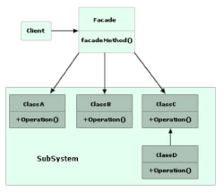

## Facade ##

Facade pattern hides the complexities of the system and provides an interface to the client using which the client can access the system. This type of design pattern comes under structural pattern as this pattern adds an interface to existing system to hide its complexities.

This pattern involves a single class which provides simplified methods required by client and delegates calls to methods of existing system classes.

##Class diagram##

~~~c#
namespace Facade
{
    interface IShape
    {
        void Draw();
    }
}
~~~

~~~c#
namespace Facade
{
    using System;
    public class Circle:IShape
    {
        public void Draw()
        {
            Console.WriteLine("Shape:Circle");

        }
    }
}

~~~

~~~c#
namespace Facade
{
    using System;
    public class Rectangle:IShape
    {
        public void Draw()
        {
            Console.WriteLine("Shape:Rectangle");
        }
    }
}

~~~

~~~c#
namespace Facade
{
    public class ShapeMakerFacade
    {
        private readonly IShape circle;
        private readonly IShape rectangle;

        public ShapeMakerFacade()
        {
            circle=new Circle();
            rectangle=new Rectangle();
        }

        public void DrawCircle()
        {
            circle.Draw();
        }

        public void DrawRectangle()
        {
            rectangle.Draw();
        }
    }
}

~~~

Usage
~~~c#
namespace Facade
{
    using System;
    class Program
    {
        static void Main(string[] args)
        {
            ShapeMakerFacade facade=new ShapeMakerFacade();
            Console.WriteLine("Circle");
            facade.DrawCircle();
            Console.WriteLine("---------------  ");
            Console.WriteLine("Rectangle");
            facade.DrawRectangle();

        }
    }
}

~~~
