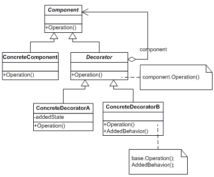

## Decorator ##

Decorator pattern allows a user to add new functionality to an existing object without altering its structure. This type of design pattern comes under structural pattern as this pattern acts as a wrapper to existing class.

This pattern creates a decorator class which wraps the original class and provides additional functionality keeping class methods signature intact.

##Class diagram##

~~~c#
namespace Decorator
{
   public abstract class Shape
   {
       public abstract void Draw();
   }
}

~~~
~~~c#
namespace Decorator
{
    using System;
    public class Circle : Shape
    {
        public override void Draw()
        {
            Console.WriteLine("Shape:Circle");
        }
    }
}

~~~

~~~c#
namespace Decorator
{
    using System;

    public class Rectangle:Shape
    {
        public override void Draw()
        {
            Console.WriteLine("Shape:Rectangle");
        }
    }
}

~~~

~~~c#
namespace Decorator
{
    public abstract class ShapeDecorator : Shape
    {
        protected ShapeDecorator(Shape shape)
        {
            this.Shape = shape;
        }

        protected Shape Shape { get; set; }

        public override void Draw()
        {
            this.Shape.Draw();
        }
    }
}

~~~

~~~c#
namespace Decorator
{
    using System;
    public class BlueShapeDecorator : ShapeDecorator
    {
        public BlueShapeDecorator(Shape shape)
            : base(shape)
        {

        }

        public override void Draw()
        {
            this.Shape.Draw();
            SetBorder(this.Shape);
        }

        private void SetBorder(Shape shape)
        {
            Console.WriteLine("Border color:Blue");

        }
    }
}

~~~
Usage
~~~c#
namespace Decorator
{
    using System;

    class Program
    {
        static void Main(string[] args)
        {
            Shape circe=new Circle();

            Shape blueCircle= new BlueShapeDecorator(new Circle());

            Shape blueRectangle=new BlueShapeDecorator(new Rectangle());

            Console.WriteLine("----------------------");
            Console.WriteLine("Normal circle");
            circe.Draw();
            Console.WriteLine("----------------------");

            Console.WriteLine("Circle with blue border");
            blueCircle.Draw();
            Console.WriteLine("----------------------");

            Console.WriteLine("Rectangle with blue border");
            blueRectangle.Draw();
            Console.WriteLine("----------------------");

        }
    }
}

~~~
